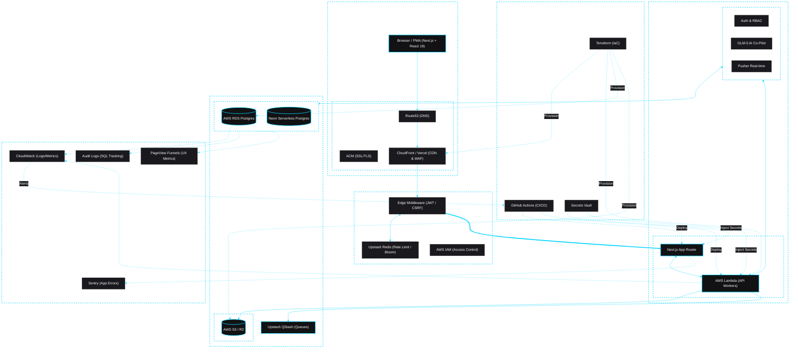

# StatWoX Strategic Architecture (Phases 1-14)

This diagram outlines the complete multi-cloud technical ecosystem of StatWoX, organized by functional "Planes" as per the 2026 Enterprise Standards.

## Architectural Design Principles (Phase 10+ Standard)

### 1. Hybrid Provisioning Strategy
- **Infrastructure as Code (Terraform)**: All AWS resources (RDS, S3, CloudFront, VPC) are provisioned via Terraform to ensure environment parity and drift detection.
- **CI/CD (GitHub Actions)**: Every commit triggers a multi-stage pipeline that runs `vitest`, `biome` linting, and then deploys to BOTH Vercel (Front) and AWS Lambda (dedicated backend workers).

### 2. Multi-Layer Security Perimeter
- **CloudFront WAF**: Blocks SQL injection and bot traffic at the edge.
- **Next.js Middleware**: Edge-computed authentication checks using the `jose` library to prevent unauthenticated requests from hitting the database.
- **Upstash Redis Bloom Filters**: High-speed uniqueness checks for IP-based rate limiting (Phase 12 addition).

### 3. Distributed Observability Matrix
- **Infra Monitoring (CloudWatch)**: Monitors RDS connection pooling, Lambda execution duration, and Billing thresholds (`EstimatedCharges`).
- **App Monitoring (Sentry)**: Captures detailed stack traces and React hydration errors.
- **Activity Monitoring (Audit Logs)**: A database-native layer for tracing critical user-level changes (e.g., survey deletion).

### 4. Storage Decoupling
- **Neon/RDS Postgres**: Relational isolation for user profiles and survey metadata.
- **AWS S3 / Cloudflare R2**: Decoupled object storage for question images and file-uploads with zero-egress cost optimization.
- **Upstash QStash**: Asynchronous decoupling of long-running tasks (e.g., mass AI processing) from the main request/response cycle.
