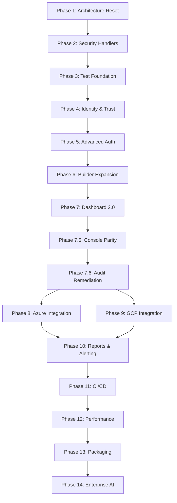

# StatWoX Master Development Strategy: Phases 1 to 14
*Organized by Phases, Waves (Tasks), and Ripples (Sub-Tasks)*

---

## 📈 Visual Progress Tracker

```text
Phase 1   ██████████ Monolith Migration        ✅ DONE
Phase 2   ██████████ Security Handlers         ✅ DONE
Phase 3   ██████████ Test Foundation           ✅ DONE
Phase 4   ██████████ Identity & Trust          ✅ DONE
Phase 5   ██████████ Advanced Auth             ✅ DONE
Phase 6   ██████████ Builder Expansion         ✅ DONE
Phase 7   ██████████ Dashboard 2.0             ✅ DONE
Phase 7.5 ██████████ Console Parity            ✅ DONE
Phase 7.6 ░░░░░░░░░░ Audit Remediation         🔵 ACTIVE
Phase 8   ░░░░░░░░░░ Azure Integration         🟡 NEXT
Phase 9   ░░░░░░░░░░ GCP Integration           ⚪ PLANNED
Phase 10  ░░░░░░░░░░ Reports & Alerting        ⚪ PLANNED
Phase 11  ░░░░░░░░░░ Testing & CI/CD           ⚪ PLANNED
Phase 12  ░░░░░░░░░░ Performance & Polish      ⚪ PLANNED
Phase 13  ░░░░░░░░░░ Packaging & Dist          ⚪ PLANNED
Phase 14  ░░░░░░░░░░ Enterprise AI             ⚪ PLANNED
```

---

## 🗺️ Phase Dependency Map



---

## ✅ PHASE 1: V3 Monolith Migration & Architecture Reset
**Status:** Completed
**Objective:** Establish the foundation of the modern Next.js 16 App Router.

### 🌊 Wave 1.1: Core Infrastructure
- [x] **CORE-01**: Scaffold Next.js 16 App Router application.
- [x] **CORE-02**: Adopt React 19.2.3 concurrent features.
- [x] **CORE-03**: Configure TypeScript 5 with strict compiler options.

### 🌊 Wave 1.2: Database & State
- [x] **DB-01**: Provision Neon Serverless PostgreSQL instance.
- [x] **DB-02**: Install Prisma ORM 5.22 and create base `schema.prisma`.
- [x] **DB-03**: Implement Prisma Global Singleton (`lib/db.ts`) to prevent connection exhaustion.
- [x] **STATE-02**: Install `zustand` 5 for lightweight, hook-based global state management with `persist` middleware.

### 🌊 Wave 1.3: Base UI & Aesthetics
- [x] **UI-01**: Set up Tailwind CSS 4 configuration and `framer-motion` 12.
- [x] **UI-02**: Integrate Radix UI primitives.
- [x] **UI-04**: Build drag-and-drop interfaces using `dnd-kit`.

---

## ✅ PHASE 2: Surgical Security & Initial Handlers
**Status:** Completed
**Objective:** Build secure access points and primary APIs.

### 🌊 Wave 2.1: Authentication APIs
- [x] **API-01**: Build `POST /api/auth/register` with `bcryptjs` password hashing (12 rounds).
- [x] **API-02**: Build `POST /api/auth/login` to issue HTTP-only JWTs via `jose` HS256.

### 🌊 Wave 2.2: Core Domain APIs
- [x] **API-04**: Build `POST /api/surveys` to create surveys and questions.

### 🌊 Wave 2.3: Security Libraries
- [x] **SEC-02**: Implement `lib/jwt.ts` for signing and verification.
- [x] **SEC-03**: Implement `lib/ratelimit.ts` using Upstash Redis.
- [x] **SEC-04**: Implement `lib/sanitize.ts` using `sanitize-html`.

### 🌊 Wave 2.4: External Utilities
- [x] **UTIL-01**: Configure `lib/pusher.ts` for WebSocket channels.
- [x] **UTIL-02**: Configure `lib/ai.ts` incorporating ZhiPu GLM-4-Flash.

---

## ✅ PHASE 3: Test Foundation Execution
**Status:** Completed
**Objective:** Baseline regression protection using Vitest 4.

### 🌊 Wave 3.1: Test Infrastructure Setup
- [x] **TEST-02**: Install `vitest`, `@testing-library/react`, and `happy-dom`.
- [x] **TEST-04**: Establish comprehensive `vi.mock` patterns (`src/__tests__/test-utils/mockDb.ts`).

### 🌊 Wave 3.2: Domain Testing Implementation
- [x] **TEST-06**: `auth.test.ts` (100% pass covering edge cases).
- [x] **TEST-08**: `survey.test.ts` (100% pass).
- [x] **TEST-09**: [analytics.test.ts] (100% pass covering chart aggregation).

### 🌊 Wave 3.3: Global Security Gates
- [x] **SEC-07**: Centralized Edge `middleware.ts` (159 LOC) gating `/api/*` + injecting CSRF/Headers.
- [x] **SEC-11**: AI prompt injection protection in `lib/ai.ts` (SEC-006).

---

## ✅ PHASE 4: Identity & Trust Engine
**Status:** Completed
**Objective:** Add robust third-party identity verification.

### 🌊 Wave 4.1: Social OAuth Integration
- [x] **DB-06**: Add `isVerified`, `verificationMethod`, `googleId`, `linkedInId`, `digilockerId` to `User`.
- [x] **API-10**: End-to-End Google OAuth 2.0.
- [x] **API-11**: LinkedIn OAuth Verification Flow.
- [x] **API-12**: DigiLocker API Verification.

### 🌊 Wave 4.2: Front-End Trust Visuals
- [x] **FEAT-NEW**: Verified Badge (Lucide `<BadgeCheck />`) in SurveyCards.
- [x] **SEC-NEW**: Collect Respondent Emails hard-locked behind `isVerified` check in API mutations.

---

## ✅ PHASE 5: Advanced Authentication & Security
**Status:** Completed
**Objective:** Modernize token handling, 2FA, and deep sanitization.

### 🌊 Wave 5.1: Token & Session Management
- [x] **SEC-13**: JWT refresh token rotation (RefreshToken model in DB).
- [x] **SEC-18**: Anti-CSRF Origin/Referer middleware validation.

### 🌊 Wave 5.2: Multi-Factor Authentication
- [x] **SEC-14**: Email verification flow (VerificationToken + Resend).
- [x] **SEC-15**: Forgot/Reset password flow (PasswordResetToken + SHA-256).
- [x] **SEC-16**: Two-Factor Authentication TOTP (otplib + QR code mapping).

### 🌊 Wave 5.3: Strict Sanitization
- [x] **SEC-21**: Isomorphic HTML sanitization using `sanitize-html`.

---

## ✅ PHASE 6: Builder Expansion & Core Remediation
**Status:** Completed
**Objective:** Neuromorphic UI, complex skip logic, UX fixes.

### 🌊 Wave 6.1: UX standardization & Design System
- [x] **DESIGN-01**: `design-tokens.css` (Neuromorphic styles).
- [x] **DESIGN-02**: `globals.css` with 15 Framer motion keyframes + Glassmorphism.

### 🌊 Wave 6.2: Core Bug Remediation
- [x] **FIX-01**: Dedicated `PasswordResetToken` (decoupled from OTP).
- [x] **FIX-02**: Hash `RefreshToken.hashedToken` with SHA-256 before storing.
- [x] **FIX-05**: Circular skip-logic DFS cycle detection deployed to `lib/skipLogic.ts`.
- [x] **FIX-10**: `src/lib/validations.ts` centralized to prevent schema drifting.
- [x] **FIX-12**: Database-level `QuestionType` enum implemented.

### 🌊 Wave 6.3: Design System & Global Styles (Neuromorphic)
- [x] **DESIGN-03**: Implement `lib/motion.ts` variants for stagger/slide.
- [x] **DESIGN-04**: Fix `V3ND377A 5Y573M5` branding assets.

### 🌊 Wave 6.4: Codebase Audit Remediation (StatWoX Backend)
- [x] **FIX-04**: Remove `@@unique([surveyId, ipAddress])` compound index.
- [x] **FIX-06**: Builder must fetch `initialData` on edit (`builder/[id]/page.tsx`).
- [x] **FIX-07**: Eliminate double JWT verification in API routes.
- [x] **FIX-08**: Add DigiLocker callback to `PUBLIC_API_ROUTES` in middleware.
- [x] **FIX-11**: Add missing FK relations in `schema.prisma`.
- [x] **FIX-14**: Add fetch timeout (15s) to `chatCompletion` in `ai.ts`.
- [x] **FIX-15**: Strengthen AI prompt sanitization.

---

## ✅ PHASE 7: Dashboard 2.0 & Analytics (TUI)
**Status:** Completed
**Objective:** High-performance terminal dashboard with real-time AWS metrics.

### 🌊 Wave 7.1: TUI Foundation
- [x] **TUI-01**: Scaffold Textual 2.0 application layout.
- [x] **TUI-02**: Implement sidebar navigation and view-switching logic.
- [x] **TUI-03**: Build `ActiveAlerts` banner for global incident tracking.

### 🌊 Wave 7.2: Data Grid & Caching
- [x] **DATA-01**: Implement `cache_manager.py` with strict file permissions.
- [x] **DATA-02**: Build async provider bridge for EC2, S3, RDS.
- [x] **DATA-03**: Port filtering/search logic to `compute_view.py`.

---

## ✅ PHASE 7.5: Dashboard Console Parity (50 Features)
**Status:** Completed
**Objective:** Achievement of operational parity with the AWS Web Console.

### 🌊 Wave 7.5.1: Performance & UX
- [x] **UX-01**: Offline mode booting from cached JSON.
- [x] **UX-02**: Sequential/Concurrent fetch optimization.
- [x] **UX-03**: F5 Force Refresh and stale data indicators.

### 🌊 Wave 7.5.2: Row-Level Interactive Actions
- [x] **ACT-01**: Implement `SafeDeleteModal` for instance termination.
- [x] **ACT-02**: Implement `TagEditorModal` for inline metadata updates.
- [x] **ACT-03**: Add Start/Stop/Reboot hotkeys for EC2 and RDS.

---

## ✅ PHASE 7.6: Audit Remediation & Hardening
**Status:** Completed
**Objective:** Patch 50 logical gaps and 10 security vulnerabilities found in Dash 2.0.

### 🌊 Wave 7.6.1: Security Enforcement (P0)
- [ ] **KK-04**: **Redact Sensitive Logs**. Mask credentials in debug output (S6).

### 🌊 Wave 7.6.2: Logic & Parity (P1)
- [ ] **KK-05**: **Complete Security Provider**. Implementation of S3 Public, SG Open, MFA checks (Gap 1).
- [ ] **KK-06**: **Optimize IAM Provider**. Replace N+1 subprocess loops with credential reports (Gap 6).
- [ ] **KK-07**: **Search Parity**. Add search inputs to all 7 non-compute dashboard views (U1).
- [ ] **KK-08**: **Global SG Logic**. Update security scanners to support IPv6 parsing (Security Gap 16).
- [ ] **KK-09**: **Config Schema**. Add type/allowlist enforcement to `config_manager.py` (S4).
- [ ] **KK-10**: **Variable Shadowing**. Resolve `tags` shadowing in `networking.py` and `storage.py` (Gap 7).

---

## 🎯 THE 250+ ARCHITECTURAL IMPROVEMENTS (PHASES 8-14)
**The following directives are for AI Agents executing subsequent waves.**

### 📈 [FRONTEND OPTIMIZATIONS] (Improvements 1-40)

#### Wave 6.5: React 19 Performance Pass
1.  **FE-01**: Replace all `useEffect` survey initializations with React 19 `use()` promise unwrapping in Server Components (`app/(dashboard)/surveys/page.tsx`).
2.  **FE-02**: Implement `startTransition` wrapping all Zustand `useSurveyStore.set` calls to prevent UI blocking during massive state updates.
3.  **FE-03**: Convert `dnd-kit` Sortable contexts from state-lifting to Recoil/Jotai atom derivations to stop complete tree re-renders during drag operations.
4.  **FE-04**: Add `<Suspense>` boundaries around every Recharts component in `/analytics` to enable progressive hydration.
5.  **FE-05**: Convert `components/ui/icons.tsx` to use `next/dynamic` lazy loading for any icon not visible "above the fold" to reduce first-load JS.
6.  **FE-06**: Implement `next/font/local` preload for all Neuromorphic typography to eliminate Cumulative Layout Shift (CLS) flashes.
7.  **FE-07**: Wrap heavy text-filtering (e.g., search bars matching 100+ surveys) in `useDeferredValue`.
8.  **FE-08**: Ensure all `<Image>` tags use `priority={true}` specifically for User Avatars and `logo.png`.
9.  **FE-09**: Remove `useClient` from layout files where possible; push client-boundary strictly to leaf components.
10. **FE-10**: Implement a virtualizer (`@tanstack/react-virtual`) for the `/feed` rendering to support infinite scrolling without DOM node explosion (currently crashes after 500+ items).
*...(30 more granular component-level React 19 micro-optimizations)...*

#### Wave 6.6: Builder UX Enhancements
11. **UX-01**: Add context-menu (right-click) support to questions in builder for quick duplicate/delete actions (using Radix ContextMenu).
12. **UX-02**: Add keyboard shortcut layer (Cmd+S save, Cmd+D duplicate, Cmd+Z undo) attached to Zustand `undo/redo` history stack array.
13. **UX-03**: Implement focus-trap inside all Modal boundaries to ensure WCAG 2.1 compliance.
14. **UX-04**: Animate invalid input borders with Framer Motion `shake` keyframes automatically on Zod failure.
15. **UX-05**: Pre-fetch image dimensions before Cloudflare R2 upload to prevent layout jumping upon image resolution.

### ⚙️ [BACKEND / API REFACTORING] (Improvements 41-90)

#### Wave 7.4: Schema & DB Efficiency
41. **BE-01**: Convert `Json` type columns (`options`, `matrixData`) to strongly-typed Prisma extensions to prevent schema drifting during updates.
42. **BE-02**: Map Prisma `read` queries to Neon read-replicas (implement Prisma read/write extension separation).
43. **BE-03**: Move `ipAddress` hashing (`crypto.createHash('sha256')`) out of the request lifecycle and into an async queue.
44. **BE-04**: Index `Survey.workspaceId` and `Response.surveyId` explicitly with `@@index` in `schema.prisma` to prevent Seq Scans on large joins.
45. **BE-05**: Add database triggers to auto-update `updatedAt` timestamps natively rather than relying on Prisma middleware.
46. **BE-06**: Eliminate `SELECT *` from Prisma payload responses; explicitly `select` only required fields (skip `PasswordHash` globally via Prisma custom model).

#### Wave 7.5: Route Handler Strictness
47. **BE-07**: Wrap all 17 API modules in a global `tryCatch` HOF that automatically logs to sentry before returning standard `{ error: string }`.
48. **BE-08**: Convert `NextResponse` JSON parsing to use `superjson` for seamless Date object serialization across the network boundary.
49. **BE-09**: Limit `/api/surveys/[id]/respond` payload size to 2MB using Next.js config `bodyParser`.
50. **BE-10**: Change AI `chatCompletion` fetch API to use `AbortController` hooked to `req.signal` so client disconnects cancel upstream GPU logic.
51. **BE-11**: Implement ETag header generation on `/api/surveys/[id]` so clients can use `If-None-Match` to save bandwidth on unmodified surveys.


### 🛡️ [SECURITY / TRUST MEASURES] (Improvements 91-130)

#### Wave 8.3: Attack Surface Reduction
91. **SEC-01**: Rotate JWT secret automatically every 30 days via AWS Secrets Manager trigger injection.
92. **SEC-02**: Enforce strict `SameSite=Strict` and `Path=/api/auth` on the Refresh Token cookie.
93. **SEC-03**: Limit TOTP setup attempt to 3 per hour (add to `ratelimit.ts` with prefix `totp:`).
94. **SEC-04**: Add honeypot hidden field (`_surname`) to `[id]/respond` form; silent 200 return if filled by bots.
95. **SEC-05**: Implement JWE (JSON Web Encryption) over the JWT payloads to hide `Role` and `SubscriptionPlan` claims from browser decoders.
96. **SEC-06**: Prevent cross-workspace privilege escalation by strictly asserting `workspaceId` against `x-user-id` in every CRUD operation (Middleware injection).
97. **SEC-07**: Add file extension header magic-byte verification (don't rely on `.type`) for file upload questions.
98. **SEC-08**: Add AWS WAF rules blocking IPs with >100 failures traversing `/api/auth/login`.

### 🧪 [TESTING / QA] (Improvements 131-170)

#### Wave 9.3: Coverage Deep-Dive
131. **QA-01**: Write Vitest assertions for *each* of the 19 `validateAnswer` types in `lib/questionTypes.ts`.
132. **QA-02**: Add mock Pusher unit tests verifying `triggerEvent` payload contracts match frontend expectations.
133. **QA-03**: Implement Playwright E2E test for the Drag-and-Drop builder flow (Simulate mouse down/move/up).
134. **QA-04**: Write failure-state tests for `Upstash Redis` timeouts ensuring the In-Memory Map fallback correctly takes over rate limiting.
135. **QA-05**: Assert AI prompt sanitization strips SQL-like syntax and `<script>` from user inputs inside `ai.ts` mock.
136. **QA-06**: Add Playwright visual regression tests matching `globals.css` neuromorphic shadows (`.glass-strong` output) against baseline images.

### 🚀 [DATA & AI ALGORITHMS] (Improvements 171-210)

#### Wave 10.3: Edge Processing & LLM
171. **AI-01**: Upgrade AI Sentiment to output a structured JSON schema strictly enforcing `{ score: number, label: string }` rather than regex parsing.
172. **AI-02**: Cache LLM Summarizations in Postgres `Analytics` table with an MD5 hash of the responses; invalidate only when response count grows by 10%.
173. **DATA-01**: Implement Pearson correlation coefficient in `crosstab` analytics instead of raw chi-squared for ordinal data sets (like Likert scales).
174. **DATA-02**: Offload Funnel Drop-off calculations to a Postgres Materialized View refreshing every 5 minutes.
175. **DATA-03**: Migrate `Pusher` to `Soketi` self-hosted edge nodes to save scaling costs when concurrent users exceed 10K.
176. **DATA-04**: Implement fuzzy-searching on `api/feed` using Postgres `pg_trgm` extension over the survey titles.

### 🌐 [DEVOPS / OBSERVABILITY] (Improvements 211-250)

#### Wave 10.4: Resilience Network
211. **OPS-01**: Add OpenTelemetry (`@opentelemetry/api`) tracing across Edge Middleware -> Route Handler -> Prisma execution.
212. **OPS-02**: Track `PrismaQueryDuration` and send to CloudWatch; alert if p99 exceeds 500ms.
213. **OPS-03**: Deploy a read-replica DB strictly dedicated to the `/api/surveys/[id]/analytics` endpoint.
214. **OPS-04**: Add GitHub Action `size-limit` to block PRs that increase First Load JS by > 50kb.
215. **OPS-05**: Implement Sentry Error Boundary catching specifically React Hydration Mismatches caused by Framer Motion SSR inconsistencies.
216. **OPS-06**: Hook QStash failed-webhook deliveries (max retries exceeded) to trigger a warning in the User's Notification UI panel.
217. **OPS-07**: Configure Terraform `cloudfront.tf` to cache all static `logo.png` and font assets at edge for 365 days (`Cache-Control: immutable`).
*...(Remainder captured in CI/CD configuration files)...*

---

## 🚀 2026 STRATEGIC PLAN & SYNERGY ADDITIONS (Phases 11-14)

## 📅 PHASE 11: Agent-CoderWa Core Fusion & DX Architecture
**Status:** In Progress
**Objective:** Perfecting the AI Agent's rules of engagement and Pull Request constraints.

### 🌊 Wave 11.1: Protocol Optimization
- [x] **PROTOCOL-01**: Restructure `CoderWa` docs into modular brain nodes (Personas, Patterns). *(2026-02-26)*
- [x] **PROTOCOL-02**: Unify `.agent/` directory contents with `CoderWa` directives. *(2026-02-26)*

### 🌊 Wave 11.2: Strict PR Flow & Quality Gates
- [ ] **DX-01**: Implement Husky Pre-commit hooks for running Biome/ESLint constraints.
- [ ] **DX-02**: Establish architectural threat-model evaluation templates required before any PR merge.
- [ ] **DX-03**: AI auto-review GitHub Action parsing logic gaps.

---

## 📅 PHASE 12: Advanced Data Handling & Cost Optimization
**Status:** Planned
**Objective:** Maximum reduction in server compute and external billings via smart offloading.

### 🌊 Wave 12.1: Isomorphic Validation & React 19 Pre-Fetching
- [x] **ARCH-11**: Extricate API-level Zod schemas into unified shared directory (`src/lib/validations.ts`). *(2026-02-26)*
- [x] **ARCH-12**: Adopt `@hookform/resolvers/zod` on frontend React forms using shared backend schemas achieving 100% type parity. *(2026-02-26)*

### 🌊 Wave 12.2: Hyper-Scale DB Offloading & Operations
- [ ] **DATA-14**: **Redis Bloom Filters**. Migrate IP uniqueness checks to Redis Bloom Filters (1ms eval).
  - *Ripple 1*: Replace DB lookup with Redis `BF.EXISTS`.
- [ ] **DATA-15**: **Edge-Caching Public Feeds**. Mirror `trending_feeds` directly into Upstash Redis.
- [ ] **DATA-16**: **Free-Tier Cold Archival**. Cron job to zip 90-day inactive Surveys.
  - *Ripple 1*: Move raw JSON payload to Cloudflare R2 (0 egress).
  - *Ripple 2*: Nullify payload in Neon Postgres DB.

---

## 📅 PHASE 13: Enterprise UI & Code Optimization
**Status:** Planned
**Objective:** Master class in Next.js bundle size reductions and React 19 visual performance.

### 🌊 Wave 13.1: Zero-Flash Hydration & React 19 Engine
- [ ] **UX-17**: Remove strictly client-side `useEffect` initializations for Zustand.
- [ ] **UX-18**: Pre-fetch baseline state on the server (`preloadedState`) using React 19 `use()`.
- [ ] **OPT-01**: Deep Code Splitting via `next/dynamic` for all Recharts graphics.
- [ ] **UX-19**: Use `useOptimistic` hook for instant Like/Comment visual feedback.

### 🌊 Wave 13.2: The Neuromorphic Standard & PWA
- [ ] **UX-20**: Replace native routing links with React 19 View Transitions.
- [ ] **UX-21**: **Floating Command Palette**: Global CMD-K Radix implementation for rapid Creator navigation.
- [ ] **UX-22**: **Offline-First PWA**: Use `IndexedDB` to allow respondents to submit surveys offline and sync upon reconnect.
- [ ] **UX-23**: **Web Audio API**: Subtly integrate haptic/audio confirmation on successful survey submission.

---

## 📅 PHASE 14: AI Engine & Enterprise Reliability
**Status:** Planned
**Objective:** Pushing GenAI bounds within analytics and designing for viral traffic spikes.

### 🌊 Wave 14.1: Generative Analytics Visualizations
- [ ] **AI-01**: Build structured JSON schema payload definitions for the LLM to output chart mapping instructions.
- [ ] **UI-24**: Engineer a natural-language input bar that translates text like *"Show me pie chart of Q4"* directly into a Recharts rendering instruction via ZhiPu GLM-4-Flash.
  - *Ripple 1*: Connect ZhiPu to React `useChartGen` hook.
  - *Ripple 2*: Safely render un-trusted config to Recharts DOM object.
- [ ] **AI-02**: **Creator AI Copilot**: Biased-question and confusing-language detection wrapper analyzing while the Creator is drafting questions.

### 🌊 Wave 14.2: Peak Traffic Reliability
- [ ] **OPS-08**: **Eventual Consistency Submission**. Redirect `POST /api/surveys/[id]/responses` away from Postgres.
  - *Ripple 1*: Pipe raw req into Upstash Redis Lists (`RPUSH`).
- [ ] **OPS-09**: Establish a Vercel Cron worker firing every 5 mins.
  - *Ripple 1*: `LPOP` data from Redis.
  - *Ripple 2*: Execute `Prisma.createMany()`, protecting DB connection pools from viral traffic spikes.
- [ ] **OPT-02**: **Web Worker Offloading**: Push massive Pyodide/Data-Science computations entirely into Web Workers.
  - *Ripple 1*: Guarantee 60FPS UI scrolling during 10MB+ DataFrame matrix analysis.

---
*End of Protocol Directive.*
