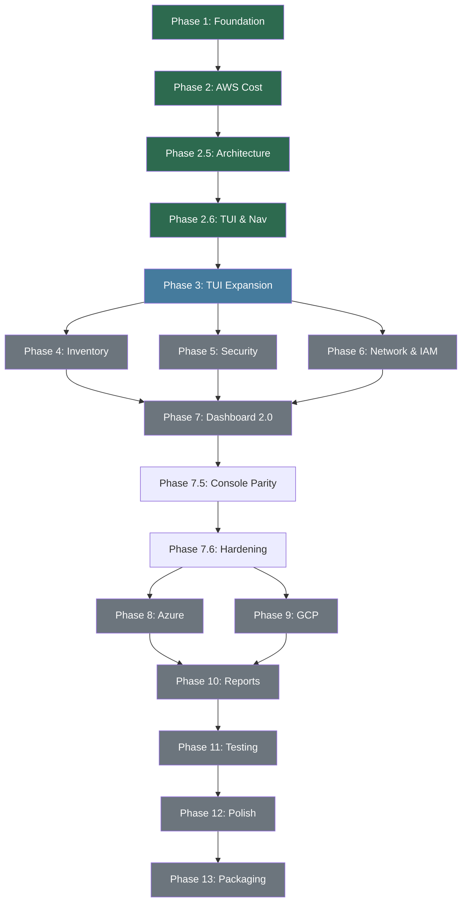

# Kloud Kompass - Master Development Plan (2026 Edition)

> Canonical phase-wise roadmap for building a production-grade multi-cloud CLI/TUI.
> **Read this first** at session start per CoderWa Protocol §2.

---

## Executive Summary

Kloud Kompass is a Python-based multi-cloud CLI/TUI for terminal practitioners. It wraps cloud provider CLIs (AWS, Azure, GCP) into a unified interface with interactive menus, Rich-formatted output, and a Textual dashboard.

**Current State (April 2026):** Phase 7.6 (Audit Remediation & Hardening) is complete. We have successfully rebranded the project to **TTox.Tech** under the **MIT License**. We are now in **Phase 13 (Packaging & Distribution)** to prepare for public release on PyPI and Debian.

---

## Phase Map

```
Phase 1   ██████████ Foundation              ✅ DONE
Phase 2   ██████████ AWS Cost Module           ✅ DONE
Phase 2.5 ██████████ Architecture Hardening    ✅ DONE
Phase 2.6 ██████████ TUI & Navigation          ✅ DONE
Phase 3   ██████████ TUI Expansion             ✅ DONE
Phase 4   ██████████ AWS Inventory             ✅ DONE
Phase 5   ██████████ AWS Security Audit        ✅ DONE
Phase 6   ██████████ Networking & IAM          ✅ DONE
Phase 7   ██████████ Dashboard 2.0             ✅ DONE
Phase 7.5 ██████████ Console Parity (50 Feat)  ✅ DONE
Phase 7.6 ██████████ Audit Remediation         ✅ DONE
Phase 8   ░░░░░░░░░░ Azure Integration         💡 NEXT
Phase 9   ░░░░░░░░░░ GCP Integration
Phase 10  ░░░░░░░░░░ Reports & Alerting
Phase 11  ░░░░░░░░░░ Testing & CI/CD
Phase 12  ░░░░░░░░░░ Performance & Polish
Phase 13  ██████████ Packaging & Distribution  🔵 ACTIVE
```

---

## ✅ Phase 1: Foundation (DONE)

**Objective:** Establish the project skeleton, CLI framework, and folder architecture.

| Wave | What was built | Key files |
|------|---------------|-----------|
| 1.1 | `pyproject.toml`, pip-installable package | `pyproject.toml` |
| 1.2 | Click CLI skeleton with `@click.group()` | `kloudkompass/cli.py` |
| 1.3 | Package structure: `core/`, `aws/`, `azure/`, `gcp/`, `utils/`, `infra/` | `kloudkompass/__init__.py` |
| 1.4 | Config management (`~/.kloudkompass/config.toml`) | `kloudkompass/config_manager.py` |
| 1.5 | Logging and debug mode | `kloudkompass/utils/logger.py` |

**Invariants established:** Click groups, `--debug` flag, version display, config TOML path.

---

## ✅ Phase 2: AWS Cost Module (DONE)

**Objective:** First working feature - query AWS Cost Explorer via CLI.

| Wave | What was built | Key files |
|------|---------------|-----------|
| 2.1 | `CostProvider` abstract base class + `CostRecord` dataclass | `core/cost_base.py` |
| 2.2 | `AWSCostProvider` - command building, execution, JSON parsing | `aws/cost.py` |
| 2.3 | CLI `cost` command with all options (`-p`, `-s`, `-e`, `--breakdown`, `--threshold`) | `cli.py` |
| 2.4 | Result formatting (table, plain, JSON, CSV) and export | `utils/formatters.py`, `utils/exports.py` |

**Invariants established:** Provider interface, subprocess wrapper, JSON parsing, output formatting.

---

## ✅ Phase 2.5: Architecture Hardening (DONE)

**Objective:** Production-grade error handling, caching, and provider factory.

| Wave | What was built | Key files |
|------|---------------|-----------|
| 2.5.1 | Exception hierarchy (10+ custom exceptions with suggestions) | `core/exceptions.py` |
| 2.5.2 | Provider factory with lazy imports + plugin registry | `core/provider_factory.py` |
| 2.5.3 | TTL+LRU in-memory cache with `@cache_result` decorator | `infra/cache.py` |
| 2.5.4 | Subprocess helpers (`run_cli_command`, `run_cli_json`, builders) | `utils/subprocess_helpers.py` |
| 2.5.5 | Pagination handler with infinite-loop guard | `utils/pagination.py` |
| 2.5.6 | Date/amount/JSON parsers | `utils/parsers.py` |
| 2.5.7 | Health checks (CLI installed, credentials valid) | `core/health.py` |
| 2.5.8 | CLI adapter for generic command execution | `infra/cli_adapter.py` |

**Invariants established:** All subprocess calls go through `run_cli_command()`, all errors are `Kloud KompassError` subclasses.

---

## ✅ Phase 2.6: TUI & Navigation (DONE)

**Objective:** Interactive terminal UI with screen lifecycle and navigation.

| Wave | What was built | Key files |
|------|---------------|-----------|
| 2.6.1 | `Screen` ABC with mount/render/unmount lifecycle | `tui/screens.py` |
| 2.6.2 | Stack-based `Navigator` controller | `tui/navigation.py` |
| 2.6.3 | Frozen `SessionState` dataclass with `with_*()` immutable updates | `tui/session.py` |
| 2.6.4 | Main Menu (4 items: Cost, Inventory, Security, Doctor) | `tui/main_menu.py` |
| 2.6.5 | Cost Wizard (provider → dates → breakdown → threshold → execute) | `tui/cost_menu.py` |
| 2.6.6 | Centralized prompt system | `tui/prompts.py` |
| 2.6.7 | Provider readiness checker | `tui/provider_setup.py` |
| 2.6.8 | Textual dashboard with sidebar, cost view, modals, keybindings | `dashboard/app.py`, `dashboard/views/`, `dashboard/widgets/` |
| 2.6.9 | Doctor health check screen, footer, `q/b` navigation | `tui/doctor.py`, `tui/footer.py` |

**Invariants established:** Screen lifecycle, immutable session, `get_input()` navigation contract, `q`/`b` globally.

---

## ✅ Phase 3: TUI Expansion (DONE)

**Objective:** Expand 4-item menu to full daily-ops suite with 10 categories.

### Wave 3.1 - Menu Infrastructure
| Task | Description | New File |
|------|-------------|----------|
| 3.1.1 | Expand `MainMenuScreen` from 4 to 10 items | Modify `tui/main_menu.py` |
| 3.1.2 | Compute Menu - list EC2s, filter by state/region/tags, instance details | `tui/compute_menu.py` |
| 3.1.3 | Network Menu - list VPCs, SGs, subnets, EIPs, SG rule viewer | `tui/network_menu.py` |
| 3.1.4 | Storage Menu - S3 buckets, EBS volumes, snapshots | `tui/storage_menu.py` |
| 3.1.5 | IAM Menu - list users, roles, policies, MFA status | `tui/iam_menu.py` |
| 3.1.6 | Database Menu - RDS instances, DynamoDB tables, ElastiCache | `tui/database_menu.py` |
| 3.1.7 | Settings Menu - edit defaults, cache TTL, profile, theme | `tui/settings_menu.py` |

### Wave 3.2 - AWS Provider Implementations
| Task | Description | New File |
|------|-------------|----------|
| 3.2.1 | EC2 provider: `describe-instances`, start/stop/reboot, instance types | `aws/compute.py` |
| 3.2.2 | VPC provider: `describe-vpcs`, `describe-subnets`, `describe-security-groups` | `aws/networking.py` |
| 3.2.3 | S3/EBS provider: `list-buckets`, `describe-volumes`, `describe-snapshots` | `aws/storage.py` |
| 3.2.4 | IAM provider: `list-users`, `list-roles`, `list-policies`, `get-login-profile` | `aws/iam.py` |
| 3.2.5 | Database provider: `describe-db-instances`, `list-tables`, `describe-cache-clusters` | `aws/database.py` |

### Wave 3.3 - Core Abstractions
| Task | Description | New File |
|------|-------------|----------|
| 3.3.1 | Abstract `ComputeProvider` (list, details, start, stop, reboot) | `core/compute_base.py` |
| 3.3.2 | Abstract `NetworkProvider` (VPCs, SGs, subnets) | `core/networking_base.py` |
| 3.3.3 | Abstract `StorageProvider` (buckets, volumes, snapshots) | `core/storage_base.py` |
| 3.3.4 | Abstract `IAMProvider` (users, roles, policies) | `core/iam_base.py` |
| 3.3.5 | Abstract `DatabaseProvider` (RDS, DynamoDB, ElastiCache) | `core/database_base.py` |
| 3.3.6 | Expand `InventoryBase` to encompass all resource types | `core/inventory_base.py` |
| 3.3.7 | Expand `SecurityBase` with standardized findings | `core/security_base.py` |
| 3.3.8 | Provider factories for compute, network, storage, IAM, DB | Modify `core/provider_factory.py` |

### Wave 3.4 - CLI Subcommands
| Task | Description | Modified File |
|------|-------------|---------------|
| 3.4.1 | `kloudkompass compute` - list, describe, start, stop | `cli.py` |
| 3.4.2 | `kloudkompass network` - vpcs, sgs, subnets, eips | `cli.py` |
| 3.4.3 | `kloudkompass storage` - buckets, volumes, snapshots | `cli.py` |
| 3.4.4 | `kloudkompass iam` - users, roles, policies | `cli.py` |
| 3.4.5 | `kloudkompass database` - rds, dynamodb, elasticache | `cli.py` |
| 3.4.6 | `kloudkompass security` - audit, scan, compliance | `cli.py` |

**Exit Criteria:** All 10 main menu items functional. AWS-only. Each lists real data via CLI.

---

## ✅ Phase 4: AWS Inventory Deep-Dive (DONE)

**Objective:** Full inventory management with filtering, tagging, and pagination for all AWS resource types.

### Wave 4.1 - Advanced Filtering
| Task | Description |
|------|-------------|
| 4.1.1 | Filter EC2 by tags (`--tags Key=Value`), instance types, AZs |
| 4.1.2 | Filter S3 by region, storage class, public access status |
| 4.1.3 | Filter RDS by engine, multi-AZ, encryption status |
| 4.1.4 | Filter SGs by inbound CIDR, protocol, port range |
| 4.1.5 | Multi-region Aggregation - query all regions, merge results |

### Wave 4.2 - Resource Operations
| Task | Description |
|------|-------------|
| 4.2.1 | Tag management - add/edit/remove tags from TUI |
| 4.2.2 | Batch operations - start/stop/tag multiple instances |
| 4.2.3 | Resource creation wizard (EC2 launch, S3 bucket create) |
| 4.2.4 | Confirmation + dry-run for destructive operations |

### Wave 4.3 - Resource Intelligence
| Task | Description |
|------|-------------|
| 4.3.1 | Unattached EBS volumes detection |
| 4.3.2 | Unused Elastic IPs detection |
| 4.3.3 | Stopped instances aging report (stopped > 30 days) |
| 4.3.4 | Resource dependency mapping (EC2 → SG → VPC → Subnet) |
| 4.3.5 | Tagging hygiene checker - find resources missing required tags |

**Exit Criteria:** `kloudkompass compute/storage/network/iam/database` all support `--filter`, `--tags`, `--region all`. Pagination works for 1000+ resources.

---

## ✅ Phase 5: AWS Security Audit (DONE)

**Objective:** Comprehensive security scanning with severity ratings and remediation.

### Wave 5.1 - Security Checks
| Task | Description |
|------|-------------|
| 5.1.1 | Public S3 buckets (ACL + policy analysis) |
| 5.1.2 | Open security groups (0.0.0.0/0 on ports 22, 3389, 0-65535) |
| 5.1.3 | IAM users without MFA |
| 5.1.4 | Unused access keys (> 90 days inactive) |
| 5.1.5 | Root account last used |
| 5.1.6 | Password policy compliance |
| 5.1.7 | CloudTrail enabled check |
| 5.1.8 | Default VPC usage detection |
| 5.1.9 | Unencrypted EBS volumes/RDS instances |
| 5.1.10 | SSL certificate expiry (< 30 days) |

### Wave 5.2 - Compliance Framework
| Task | Description |
|------|-------------|
| 5.2.1 | CIS Benchmark Level 1 checks (30+ controls) |
| 5.2.2 | Security score calculation (Critical×10, High×5, Medium×2, Low×1) |
| 5.2.3 | Trend tracking - compare scans over time |
| 5.2.4 | Remediation commands - each finding includes fix CLI command |
| 5.2.5 | Security report export (CSV/JSON/HTML with severity breakdown) |

### Wave 5.3 - TUI Integration
| Task | Description |
|------|-------------|
| 5.3.1 | Implement full `SecurityWizardScreen` (replace placeholder) |
| 5.3.2 | Severity-grouped results with color coding |
| 5.3.3 | Drill-down: finding → affected resource details |
| 5.3.4 | Fix-it wizard: guided remediation from TUI |

**Exit Criteria:** `kloudkompass security --scan all` returns findings with severity. Score calculation works. CIS L1 checks pass on a demo account.

---

## ✅ Phase 6: Networking & IAM Deep-Dive (DONE)

**Objective:** VPC topology understanding and IAM permission analysis.

### Wave 6.1 - Network Topology
| Task | Description |
|------|-------------|
| 6.1.1 | VPC visualization (VPC → subnets → route tables → IGW/NAT) |
| 6.1.2 | Security group rule analysis (effective rules, overlaps) |
| 6.1.3 | VPC peering and Transit Gateway connections |
| 6.1.4 | VPN connection status and health |
| 6.1.5 | Network ACL (NACL) rules viewer |
| 6.1.6 | Flow log analysis summary |

### Wave 6.2 - IAM Deep Analysis
| Task | Description |
|------|-------------|
| 6.2.1 | Permission boundary analysis per user/role |
| 6.2.2 | Cross-account role trust relationship viewer |
| 6.2.3 | Service-linked roles inventory |
| 6.2.4 | Inline vs managed policy comparison |
| 6.2.5 | Access Advisor - last-used service tracking |
| 6.2.6 | IAM credential report generation |

**Exit Criteria:** Network topology renders as tree view in TUI. IAM analysis shows effective permissions.

---

## ✅ Phase 7: Dashboard 2.0 (DONE)

**Objective:** Transform the Textual dashboard from a skeleton into a fully functional operations center.

### Wave 7.1 - Fix Existing Issues
| Task | Description |
|------|-------------|
| 7.1.1 | Fix `_switch_view()` to actually swap content panels |
| 7.1.2 | Add loading states (spinner/skeleton during data fetch) |
| 7.1.3 | Add error states with retry buttons |
| 7.1.4 | Add empty states with meaningful messages |

### Wave 7.2 - New Dashboard Views
| Task | Description | New File |
|------|-------------|----------|
| 7.2.1 | Compute view - EC2 table with status indicators | `dashboard/views/compute_view.py` |
| 7.2.2 | Network view - VPC/SG summary cards | `dashboard/views/network_view.py` |
| 7.2.3 | Security view - findings list with severity badges | `dashboard/views/security_view.py` |
| 7.2.4 | IAM view - user/role list with permission summary | `dashboard/views/iam_view.py` |

### Wave 7.3 - Dashboard Widgets
| Task | Description | New File |
|------|-------------|----------|
| 7.3.1 | Resource count summary (EC2: 12, S3: 5, RDS: 3...) | `dashboard/widgets/resource_summary.py` |
| 7.3.2 | Security score gauge (0-100 with color) | `dashboard/widgets/security_score.py` |
| 7.3.3 | Cost trend sparkline | `dashboard/widgets/cost_chart.py` |
| 7.3.4 | Active alerts widget | `dashboard/widgets/alerts.py` |

### Wave 7.4 - Dashboard UX
| Task | Description |
|------|-------------|
| 7.4.1 | Live auto-refresh with countdown timer |
| 7.4.2 | Dashboard layout persistence (remember last view) |
| 7.4.3 | Command palette (`Ctrl+P`) for quick navigation |
| 7.4.4 | Tab key navigation between sidebar and content |
| 7.4.5 | Responsive layout for various terminal sizes |

**Exit Criteria:** All sidebar buttons show real data. Auto-refresh works. Content panels actually switch.

---

## ✅ Phase 7.5: Dashboard Console Parity — 50 Features (DONE)

**Objective:** Transform the dashboard from a read-only view into a blazingly fast, fully interactive command center that rivals web-based cloud consoles.

### Category 1: Extreme Performance & Caching (10 features)
Local disk caching (`core/cache_manager.py`) with `0o700`/`0o600` permissions, instant boot from cache, `asyncio.gather` concurrent fetching, configurable TTL, stale data indicators, `F5` force refresh, offline mode fallback, lazy tab loading, pagination yielding.

### Category 2: UI Filtering & Search (10 features)
Global search `Input` widget, fuzzy matching, regex support (`^vpc-.*`), `/` type-to-search, column sorting via header click, `R` state filtering, `tag:Key=Value` syntax, `Esc` clear filters, saved searches per-view, hit counters (`Showing 15/200`).

### Category 3: Interactive Row-Level Actions (15 features)
Row selection, action palette, EC2 start/stop/terminate hotkeys, inline tag editor modal (`widgets/tag_editor_modal.py`), clipboard copy (ID and JSON), S3 open-in-browser, RDS inline start/stop, security finding ignore workflow, multi-select (`Space`), batch execute, safe deletion modal (`widgets/safe_delete_modal.py`), action toasts, action queueing.

### Category 4: Console UI Parity Layout (15 features)
Split-pane details sidebar, JSON inspector tab, CloudWatch metrics tab, SG/VPC resolver deep-linking, toggleable sidebar (`[`), auto-resizable columns, breadcrumbs, dark/light mode (`D`), customizable hotkeys (`core/keymap.py`), export selected CSV (`ctrl+e`), color-coded status, AWS health incident banner, auto-updater check (`core/updater.py`).

| New Module | Purpose |
|---|---|
| `core/cache_manager.py` | Disk JSON cache with strict UNIX permissions |
| `core/keymap.py` | Customizable hotkeys via `~/.kloudkompass/keymap.json` |
| `core/updater.py` | PyPI auto-update version checker |
| `widgets/safe_delete_modal.py` | Typed-ID confirmation for destructive ops |
| `widgets/tag_editor_modal.py` | Inline key/value tag editor |

**Exit Criteria:** All 50 features implemented. 732 tests pass. Dashboard boots from cache in <0.5s. Row-level actions fire against AWS APIs.

---

## ✅ Phase 7.6: Audit Remediation & Hardening (DONE)

**Objective:** Patch 50 logical gaps, 10 security vulnerabilities, and implement 100 UI/UX high-impact improvements identified in the March 2026 Audit.

### Wave 7.6.1: Security & Stability (P0)
- **Sanitize Subprocess Calls**: Redact secrets from logs and quote all command arguments to prevent shell injection (S2, S6).
- **Atomic Cache**: Implement `tempfile` + `rename` for `set_cache` to prevent corruption (Gap 2).
- **Sanitize Cache Keys**: Prevent path traversal via command strings (S1).
- **Fix Variable Shadowing**: Repair `tags` shadowing in `networking.py` and `storage.py` (Gap 7).
- **Populate Details State**: Ensure `_instance_data` is hydrated for the SG/VPC resolvers (Gap 8).

### Wave 7.6.2: Logic & Parity (P1)
- **Security Provider Completion**: Implement the stubbed `AWSSecurityProvider` checks (Gap 1).
- **IAM Optimization**: Replace N+1 API pattern with `generate-credential-report` (Gap 6).
- **Global Search**: Add the filtering `Input` widget to all 7 non-compute views (U1).
- **Fix Shadowing**: Resolve `tags` shadowing in `list_subnets` and `list_volumes`.

### Wave 7.6.3: UI/UX Excellence (P2)
- **Navigation Polish**: Add `Tab` cycling, breadcrumb links, and command palette `Ctrl+K` (U2, U8, U9).
- **Table Polish**: Add row striping, column visibility toggles, and relative timestamps (U13, U16, U18).
- **Feedback Loop**: Add action progress bars and "Undo" toast notifications (U39, U40).

**Exit Criteria:** All 10 security vulnerabilities resolved. No stubbed methods in AWS providers. Search functional on all views. 800+ tests passing.

---

## Phase 8: Azure Integration

**Objective:** Full Azure parity with AWS features.

### Wave 8.1 - Azure Cost
| Task | Description | New File |
|------|-------------|----------|
| 8.1.1 | `AzureCostProvider` - `az consumption usage list` | `azure/cost.py` |
| 8.1.2 | Azure cost parsing and normalization to `CostRecord` | |
| 8.1.3 | Azure date format handling and currency conversion | |

### Wave 8.2 - Azure Inventory
| Task | Description | New File |
|------|-------------|----------|
| 8.2.1 | VMs - `az vm list`, `az vm show` | `azure/compute.py` |
| 8.2.2 | Storage - `az storage account list`, `az storage blob list` | `azure/storage.py` |
| 8.2.3 | Networking - `az network vnet list`, `az network nsg list` | `azure/networking.py` |
| 8.2.4 | IAM - `az ad user list`, `az role assignment list` | `azure/iam.py` |
| 8.2.5 | Database - `az sql server list`, `az cosmosdb list` | `azure/database.py` |

### Wave 8.3 - Azure Security
| Task | Description | New File |
|------|-------------|----------|
| 8.3.1 | NSG rule analysis (open ports) | `azure/security.py` |
| 8.3.2 | Public blob containers | |
| 8.3.3 | Users without MFA (Azure AD) | |

**Exit Criteria:** `kloudkompass cost -p azure` returns real data. TUI menus show Azure as selectable. Cross-cloud cost comparison works.

---

## Phase 9: GCP Integration

**Objective:** GCP feature parity matching AWS and Azure.

### Wave 9.1 - GCP Cost
| Task | Description | New File |
|------|-------------|----------|
| 9.1.1 | `GCPCostProvider` - BigQuery billing export or `gcloud billing` | `gcp/cost.py` |
| 9.1.2 | GCP cost normalization | |

### Wave 9.2 - GCP Inventory
| Task | Description | New File |
|------|-------------|----------|
| 9.2.1 | Compute Engine - `gcloud compute instances list` | `gcp/compute.py` |
| 9.2.2 | Cloud Storage - `gcloud storage ls` | `gcp/storage.py` |
| 9.2.3 | VPC - `gcloud compute networks list` | `gcp/networking.py` |
| 9.2.4 | IAM - `gcloud iam service-accounts list` | `gcp/iam.py` |
| 9.2.5 | CloudSQL / Firestore | `gcp/database.py` |

### Wave 9.3 - Cross-Cloud Unified View
| Task | Description |
|------|-------------|
| 9.3.1 | `kloudkompass cost -p all` - unified multi-cloud cost table |
| 9.3.2 | `kloudkompass compute -p all` - all instances across all clouds |
| 9.3.3 | `kloudkompass security -p all` - merged security findings |
| 9.3.4 | Provider health matrix - which services work per provider |

**Exit Criteria:** All 3 providers return data. `-p all` aggregates correctly. TUI provider selector shows 3 options.

---

## Phase 10: Reports & Alerting

**Objective:** Automated reporting and threshold-based alerts.

### Wave 10.1 - Export Formats
| Task | Description |
|------|-------------|
| 10.1.1 | HTML report generation (self-contained, styled) |
| 10.1.2 | Markdown report generation (for README/docs) |
| 10.1.3 | PDF report via `reportlab` or `weasyprint` |
| 10.1.4 | Template system for custom report layouts |

### Wave 10.2 - Scheduled Reports
| Task | Description |
|------|-------------|
| 10.2.1 | `kloudkompass schedule` command (cron expression + export path) |
| 10.2.2 | Schedule persistence in config.toml |
| 10.2.3 | System crontab integration for Linux/macOS |

### Wave 10.3 - Alerting
| Task | Description |
|------|-------------|
| 10.3.1 | Budget threshold configuration (per provider, per service) |
| 10.3.2 | Slack webhook integration |
| 10.3.3 | Email alerts via SMTP |
| 10.3.4 | PagerDuty integration for critical security findings |
| 10.3.5 | Alert history log |

**Exit Criteria:** `kloudkompass cost --export report.html` generates styled report. Slack alerts fire on budget threshold breach.

---

## Phase 11: Testing & CI/CD

**Objective:** 90%+ coverage, automated quality gates.

### Wave 11.1 - Unit Tests
| Task | Description |
|------|-------------|
| 11.1.1 | Test all `CostProvider` parsing paths (happy, error, edge) |
| 11.1.2 | Test all TUI screens (mock `input()`, verify navigation) |
| 11.1.3 | Test session immutability (verify old instances unchanged) |
| 11.1.4 | Test cache (hit, miss, TTL expiry, LRU eviction, concurrent access) |
| 11.1.5 | Test pagination (single page, multi-page, infinite loop guard) |
| 11.1.6 | Test all provider factories (known, unknown, unimplemented) |
| 11.1.7 | Test all custom exceptions (suggestion text, error codes) |
| 11.1.8 | Test all parsers (dates, amounts, nested JSON) |
| 11.1.9 | Test formatters (table, plain, JSON, CSV output) |
| 11.1.10 | Test exports (CSV, JSON file creation and validity) |

### Wave 11.2 - Integration Tests
| Task | Description |
|------|-------------|
| 11.2.1 | LocalStack integration for AWS API simulation |
| 11.2.2 | CLI end-to-end: `kloudkompass cost` with mock responses |
| 11.2.3 | TUI end-to-end: full wizard flow with automated input |
| 11.2.4 | Config file round-trip: write → read → verify |

### Wave 11.3 - CI/CD Pipeline
| Task | Description |
|------|-------------|
| 11.3.1 | GitHub Actions: run pytest on PR |
| 11.3.2 | GitHub Actions: run mypy, black, isort |
| 11.3.3 | GitHub Actions: coverage gate (fail below 85%) |
| 11.3.4 | Pre-commit hooks: black, mypy, pytest-fast |
| 11.3.5 | Dependabot for dependency security updates |

**Exit Criteria:** `pytest --cov` shows 90%+. CI passes on every PR. Pre-commit hooks prevent regressions.

---

## Phase 12: Performance & Polish

**Objective:** Make Kloud Kompass feel instant and professional.

### Wave 12.1 - Performance
| Task | Description |
|------|-------------|
| 12.1.1 | File-based persistent cache (survives restarts) |
| 12.1.2 | Parallel multi-region queries (`concurrent.futures`) |
| 12.1.3 | Streaming output (show results as pages arrive) |
| 12.1.4 | Startup time optimization (lazy imports measured) |
| 12.1.5 | Memory profiling for large result sets |

### Wave 12.2 - UX Polish
| Task | Description |
|------|-------------|
| 12.2.1 | Rich spinners during all API calls |
| 12.2.2 | Progress bars for paginated responses |
| 12.2.3 | Color-coded cost output (green/yellow/red by threshold) |
| 12.2.4 | Breadcrumb navigation (Home > Cost > AWS > Service) |
| 12.2.5 | Empty state messages with helpful guidance |
| 12.2.6 | `--no-color` flag support for non-TTY environments |
| 12.2.7 | `--quiet` flag for scripted usage |

### Wave 12.3 - Error Polish
| Task | Description |
|------|-------------|
| 12.3.1 | Error code system (BC-001, BC-002...) for searchable docs |
| 12.3.2 | Graceful degradation (show cached data when offline) |
| 12.3.3 | Credential expiry warning (before actual failure) |
| 12.3.4 | Retry with exponential backoff for throttling |

**Exit Criteria:** Startup < 500ms. Cached queries < 100ms. All errors have codes and suggestions. Spinners on all API calls.

---

## 🔵 Phase 13: Packaging & Distribution (ACTIVE)

**Objective:** Zero-friction installation across all platforms.

### Wave 13.1 - Python Packaging
| Task | Description |
|------|-------------|
| 13.1.1 | Publish to PyPI: `pip install kloudkompass` |
| 13.1.2 | Version pinning and CHANGELOG.md automation |
| 13.1.3 | `py.typed` marker (PEP 561) |
| 13.1.4 | Type stub files (`.pyi`) for IDE support |

### Wave 13.2 - Platform Packages
| Task | Description |
|------|-------------|
| 13.2.1 | Homebrew formula for macOS |
| 13.2.2 | AUR package for Arch Linux |
| 13.2.3 | Docker image (`docker run kloudkompass`) |
| 13.2.4 | PyInstaller single-binary for zero-dep deployment |

### Wave 13.3 - Developer Experience
| Task | Description |
|------|-------------|
| 13.3.1 | Shell completion scripts (bash/zsh/fish) |
| 13.3.2 | `kloudkompass init` guided first-run setup |
| 13.3.3 | Man pages generation |
| 13.3.4 | API documentation (Sphinx) |
| 13.3.5 | Contributing guide and architecture docs |

**Exit Criteria:** `pip install kloudkompass` works. `kloudkompass --version` shows correct version. Docker image < 100MB.

---

## Quick Reference: File Impact Map

| Phase | New Files Expected | Modified Files |
|-------|--------------------|----------------|
| 3 | ~17 (menus + providers + bases) | `cli.py`, `main_menu.py`, `provider_factory.py` |
| 4 | ~3 (filters, operations, intelligence) | `aws/compute.py`, `aws/storage.py`, `tui/compute_menu.py` |
| 5 | ~5 (security checks + compliance) | `aws/security.py`, `tui/security_menu.py` |
| 6 | ~3 (network topology + IAM analysis) | `aws/networking.py`, `aws/iam.py` |
| 7 | ~8 (views + widgets) | `dashboard/app.py` |
| 8 | ~7 (Azure providers) | `azure/*`, `provider_factory.py` |
| 9 | ~7 (GCP providers) | `gcp/*`, `provider_factory.py` |
| 10 | ~5 (reports + alerts) | `cli.py`, `utils/exports.py` |
| 11 | ~15 (test files) | `pyproject.toml`, CI configs |
| 12 | ~3 (cache, parallel, UX) | Multiple existing files |
| 13 | ~5 (packaging, scripts) | `pyproject.toml`, README |

---

## Dependency Order



---

> ⚠️ **CODERWA INVARIANT**: This is the canonical development plan. Update this file when phases complete or when wave scope changes. All agents must read this before starting work on any phase.
