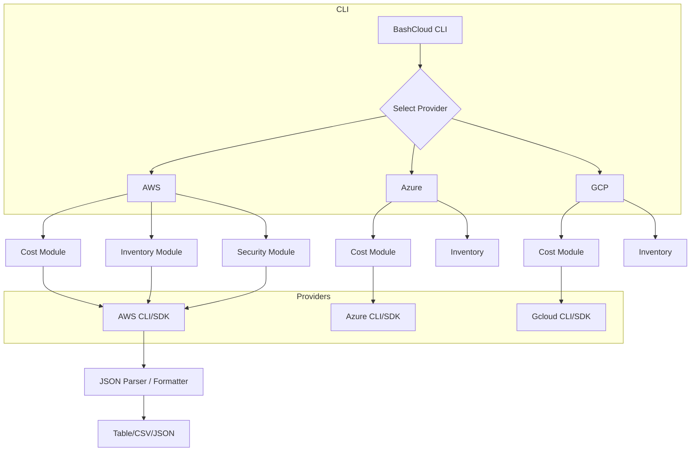

# BashCloud

A menu driven, multi-cloud CLI tool for cloud practitioners who prefer terminal workflows over GUIs.
BashCloud delivers interactive, human-friendly access to AWS, Azure, and GCP services — starting with a cost-tracking module and expanding to inventory, security, config audit, reporting, and alerting.

This README describes the project vision, architecture, workflows, QA plan, module targets, and starter module implementation guidance.

---

## Vision

Cloud engineers, auditors, SREs, DevOps practitioners, and power users should be able to interact with cloud resources from the terminal with:

* Clear guided menus
* Human-friendly language
* Exportable CLI output (CSV/JSON)
* TUI style menus
* No GUI required

BashCloud offloads the heavy work to provider CLIs (AWS CLI, Azure CLI, gcloud), wraps them, formats output, and presents a consistent cross-cloud interface.

---

## Features (current & future)

### MVP Modules

| Module                 | Purpose                                                        |
| ---------------------- | -------------------------------------------------------------- |
| **Cost**               | Fetch billing data (total, service, usage type, daily)         |
| **Compute Inventory**  | List instances/VMs across prod/staging                         |
| **Storage Inventory**  | List buckets/disks with size/region                            |
| **Identity Audit**     | List users, roles, MFA status                                  |
| **Networking Summary** | VPCs/Subnets/Firewalls                                         |
| **Security Checks**    | Basic compliance checks (public buckets, open security groups) |
| **Reports**            | Export to CSV/JSON                                             |
| **Alerts**             | Threshold alerts (email/slack via config)                      |

### Future Modules

* **Cost Forecasting**
* **Tagging Hygiene Checker**
* **Resource Clean-up Assistant**
* **IAM Policy Summary**
* **Cross-Cloud Cost Comparison**
* **Scheduler/Automaton**

---

## High-Level Architecture



---

## Standard Workflows

### Cost Module (AWS example)

```
bashcloud
└─ cost
   ├── Select provider (AWS/Azure/GCP)
   ├── Prompt Start Date (YYYY-MM-DD)
   ├── Prompt End Date (YYYY-MM-DD)
   ├── Choose breakdown:
       ├── Total
       ├── Service
       ├── Usage Type
       ├── Daily
   ├── (Optional) Threshold filter
   ├── Output options:
       ├── TUI table
       ├── CSV export
       └── JSON export
```

---

## Test Strategy

### Positive Test Cases

*All examples below assume cost module AWS context but the logic maps to other modules too.*

1. Valid date range
2. Zero cost period (free tier)
3. Multi-month range
4. Start == end (zero days)
5. Threshold filtering
6. AWS CLI not installed → prompts installer
7. AWS CLI misconfigured → prompts `aws configure`
8. Cost Explorer disabled → detect & prompt
9. Valid total cost output
10. Valid service-wise cost output
11. Valid usage-type output
12. Valid daily breakdown
13. Export CSV
14. Export JSON
15. Combine filters (dates + threshold)
16. Handles pagination (large result sets)
17. Provides help text (`bashcloud --help`)
18. Works across Windows (WSL) and Linux
19. Detects missing `jq` and suggests install
20. Completes without crashing on large outputs

### Negative Test Cases

1. Start date > end date
2. Non-ISO date input
3. Blank date input
4. Unsupported cloud provider
5. Invalid CLI credentials
6. Cost Explorer not enabled
7. Permission denied (IAM)
8. Network failure during CLI call
9. Disk full on CSV write
10. Invalid threshold (non-numeric)
11. Missing `jq` (and recommend install)
12. CLI returns malformed JSON
13. CLI returns partial page
14. CLI throttling / retry mechanisms needed
15. Export path not writable
16. Conflicting CLI profiles
17. Missing provider CLI
18. Incorrect region
19. Unexpected CLI version
20. Signal interrupt (Ctrl-C) gracefully

---

## Handling Provider CLI Output Limitations

Problem: AWS CLI “table” output truncates long lists and doesn’t paginate.

**Approach:**

1. Always use `--output json` for raw results
2. Invoke `jq`/`json` parsing
3. Handle pagination tokens for APIs that support them
4. Convert to tables internally
5. Provide CSV/JSON export by default
6. Avoid relying on CLI table formatting

Example (pseudocode):

```python
def run_with_pagination(cmd):
    results = []
    token = None
    while True:
        subcmd = cmd + (["--next-token", token] if token else [])
        res = execute_aws_cli(subcmd)
        results.extend(res["ResultsByTime"])
        token = res.get("NextPageToken")
        if not token:
            break
    return results
```

---

## Folder Structure

```
bashcloud/
├── bashcloud/
│   ├── __init__.py
│   ├── cli.py                 # entrypoint (Typer/Click)
│   ├── config.py              # shared config (profiles, regions)
│   ├── utils/
│   │   ├── __init__.py
│   │   ├── subprocess_helpers.py
│   │   ├── parsers.py
│   │   └── exports.py
│   ├── aws/
│   │   ├── __init__.py
│   │   ├── cost.py            # AWS cost module
│   │   ├── inventory.py
│   │   └── security.py
│   ├── azure/
│   │   ├── __init__.py
│   │   ├── cost.py
│   │   └── inventory.py
│   └── gcp/
│       ├── __init__.py
│       ├── cost.py
│       └── inventory.py
├── tests/
│   ├── conftest.py
│   ├── test_cost_aws.py
│   └── test_parsers.py
├── requirements.txt
├── setup.py
├── README.md
└── .gitignore
```

---

## Python Package Files

### setup.py

```python
from setuptools import setup

setup(
    name="bashcloud",
    version="0.1.0",
    description="TUI/menu driven multi-cloud CLI",
    packages=["bashcloud", "bashcloud.aws", "bashcloud.azure", "bashcloud.gcp", "bashcloud.utils"],
    install_requires=[
        "click>=8.0",
        "jq-py>=1.0",         # if needed
        "rich>=10.0",         # optional for tables
    ],
    entry_points={
        "console_scripts": [
            "bashcloud = bashcloud.cli:main",
        ],
    },
)
```

### requirements.txt

```
click>=8.1
rich>=10.9
pytest>=7.0
jq>=1.0
python-dotenv
```

---

## Starter Cost Module (AWS)

### bashcloud/aws/cost.py

```python
import json
import subprocess

def get_aws_cost(start_date, end_date, breakdown):
    cmd = [
        "aws", "ce", "get-cost-and-usage",
        "--time-period", f"Start={start_date},End={end_date}",
        "--granularity", "MONTHLY",
        "--metrics", "UnblendedCost",
    ]

    if breakdown == "service":
        cmd += ["--group-by", "Type=DIMENSION,Key=SERVICE"]
    elif breakdown == "usage":
        cmd += ["--group-by", "Type=DIMENSION,Key=USAGE_TYPE"]

    raw = subprocess.check_output(cmd)
    data = json.loads(raw)
    return data

def parse_cost(data):
    groups = data["ResultsByTime"][0]["Groups"]
    return [(g["Keys"][0], g["Metrics"]["UnblendedCost"]["Amount"]) for g in groups]
```

This is a **minimal stub**. You will expand it with:

* pagination
* error handling
* threshold filtering
* CSV/JSON export
* TUI formatting (rich tables)

---

## CLI Entrypoint (bashcloud/cli.py)

```python
import click
from bashcloud.aws.cost import get_aws_cost, parse_cost

@click.group()
def main():
    """BashCloud CLI."""
    pass

@main.command()
@click.option("--provider", prompt="Cloud Provider (aws/azure/gcp)")
@click.option("--start", prompt="Start Date (YYYY-MM-DD)")
@click.option("--end", prompt="End Date (YYYY-MM-DD)")
@click.option("--breakdown", prompt="Breakdown (total/service/usage)")
def cost(provider, start, end, breakdown):
    """Fetch cost for a provider."""
    if provider == "aws":
        data = get_aws_cost(start, end, breakdown)
        rows = parse_cost(data)
        for name, amt in rows:
            click.echo(f"{name} : {amt} USD")
    else:
        click.echo("Currently only AWS cost is implemented.")
```

---

## How to Run

```bash
pip install -e .
bashcloud cost
```

---

## Next Steps

* Implement pagination handlers
* Add Azure/GCP cost modules
* Create TUI driver (confirm choices interactively)
* Implement export utilities
* Add tests for error cases

---

## Summary

BashCloud is a **cross-cloud, CLI driven, interactive tool** that democratizes cost and inventory visibility in terminal workflows.
This README provides:

* Project vision
* Architecture
* Folder layout
* Package setup
* Starter cost module
* Test plans
* Output mitigation strategies

Let me know when you want **module 2 (compute inventory)** planned and prototyped.
