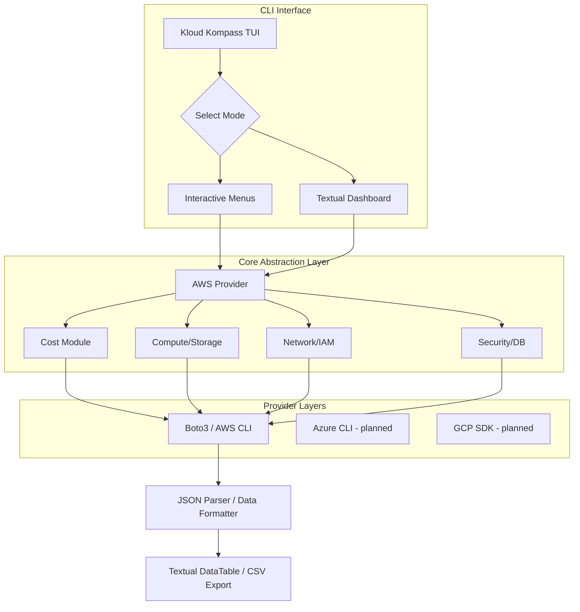

# Kloud Kompass

> **© 2026 TTox.Tech. Licensed under MIT.**
> Kloud Kompass is open-source software.

A menu driven, multi-cloud CLI tool and Textual dashboard for cloud practitioners who prefer terminal workflows over GUIs.
Kloud Kompass delivers interactive, human-friendly access to AWS services across cost tracking, compute inventory, networking, storage, IAM, databases, and security auditing. It ships with both a guided TUI (interactive menus via prompt-toolkit) and a fully featured Textual dashboard with sidebar navigation, modal dialogs, and keyboard shortcuts. Azure and GCP support is planned for future releases.

This README describes the project vision, architecture, workflows, QA plan, module targets, and implementation guidance.

***

## Vision

Cloud engineers, auditors, SREs, DevOps practitioners, and power users should be able to interact with cloud resources from the terminal with:

* Clear guided menus
* Human-friendly language
* Exportable CLI output (CSV and JSON)
* Interactive TUI style menus and dashboards
* No GUI required

Kloud Kompass offloads the heavy work to provider SDKs and CLIs, wraps them, formats output, and presents a consistent cross-cloud interface.

***

## Features

### Completed Modules

| Module                 | Purpose                                                        | Provider Status |
| ---------------------- | -------------------------------------------------------------- | --------------- |
| **Cost**               | Fetch billing data (total, service, usage type, daily)         | AWS live        |
| **Compute Inventory**  | List instances and VMs with interactive drill-down menus       | AWS live        |
| **Storage Inventory**  | List buckets and EBS volumes with unattached waste highlighting| AWS live        |
| **Identity Audit**     | List users, roles, policies, and MFA status                    | AWS live        |
| **Networking Summary** | Interactive VPCs, Subnets, and Security Group rules exploration| AWS live        |
| **Database Audit**     | RDS and DynamoDB instance management and listing               | AWS live        |
| **Security Checks**    | Built-in vulnerability scanner (public DBs, unencrypted disks) | AWS live        |
| **Doctor**             | Health checks for CLI installation, credentials, connectivity  | All providers   |
| **Reports**            | One-press export system to CSV, JSON, or Markdown formats      | All providers   |
| **Settings**           | Provider, region, profile, cache TTL configuration             | All providers   |

### Dashboard (Textual App)

The dashboard is a full Textual application with:

* **8 sidebar navigation views** (Cost, Compute, Network, Storage, IAM, Database, Security, Doctor)
* **Settings modal** with provider, region, and profile configuration
* **Export modal** for CSV, JSON, and Markdown output
* **Help modal** with keyboard shortcut reference
* **Quit confirmation** to prevent accidental exits
* **Keyboard shortcuts** for all major actions (1-8 for views, E for export, R for refresh, ? for help)
* **Kloud Kompass ASCII banner** rendered below the header

### Future Modules

* **Cost Forecasting**
* **Tagging Hygiene Checker**
* **Resource Clean-up Assistant**
* **Cross-Cloud Cost Comparison**
* **Scheduler and Automaton**

***

## High-Level Architecture



***

## Standard Workflows

### Dashboard Mode

```text
kloudkompass dashboard
├─ Kloud Kompass ASCII Banner
├─ Sidebar Navigation (8 modules)
│  ├─ Cost          (1)
│  ├─ Compute       (2)
│  ├─ Network       (3)
│  ├─ Storage       (4)
│  ├─ IAM           (5)
│  ├─ Database      (6)
│  ├─ Security      (7)
│  └─ Doctor        (8)
├─ Dynamic Content Panel
│  ├─ DataTables with async loading
│  ├─ Filter panels per view
│  └─ Status indicators and badges
├─ Modals
│  ├─ Settings (Provider, Region, Profile)
│  ├─ Export (CSV, JSON, Markdown)
│  ├─ Help (Keybinding reference)
│  └─ Quit Confirmation
└─ Attribution Footer
```

### Interactive TUI Mode

```text
kloudkompass
├─ Select Provider (AWS / Azure* / GCP*)
├─ Select Region
├─ Main Menu (10 categories)
│  ├─ Cost → Wizard (dates, breakdown, threshold, execute)
│  ├─ Compute → List, filter by state/tag/type, drill-down
│  ├─ Network → VPCs, Subnets, Security Groups, EIPs
│  ├─ Storage → S3 Buckets, EBS Volumes, Snapshots
│  ├─ IAM → Users, Roles, Policies, MFA Status
│  ├─ Database → RDS, DynamoDB, ElastiCache
│  ├─ Security → Vulnerability scan, severity findings
│  ├─ Doctor → Health checks and readiness report
│  ├─ Settings → Defaults, cache TTL, profile, theme
│  └─ Reports → Export to CSV / JSON
└─ Global navigation: [Q] Quit, [B] Back
```

\* Azure and GCP are planned for future releases.

***

## Test Strategy

**Current test suite: 724 tests across 46 test files (all passing).**

### Positive Test Cases

1. Valid date range parsing
2. Zero cost period handling
3. Multi-month range queries
4. Dynamic region fallback mechanisms
5. Threshold filtering for cost records
6. TUI Session persistence and immutability
7. Valid total cost output formatting
8. Valid service-wise cost output
9. Valid usage-type output
10. Valid daily breakdown
11. Export pipeline to CSV
12. Export pipeline to JSON
13. Combine tag filtering and state filtering
14. Handles pagination for large AWS result sets
15. Correct async thread dispatching in dashboard views
16. Works seamlessly across Windows (WSL) and Linux
17. TUI interactive menu routing
18. Input sanitization in forms
19. Screen lifecycle (mount/render/unmount) enforcement
20. Navigation stack push/pop/depth integrity
21. Frozen dataclass immutability guarantees
22. Provider factory lazy loading and plugin registry
23. Cache TTL expiry and LRU eviction
24. Health check CLI detection and credential validation
25. Dashboard modal compose/dismiss lifecycle

### Negative Test Cases

1. Start date greater than end date
2. Non ISO date string inputs
3. Blank date input handling
4. Unsupported cloud provider selection
5. Invalid CLI credentials detection
6. Cost Explorer not enabled by user
7. Permission denied mapping (IAM limits)
8. Network failure handling during Boto3 calls
9. Disk full on CSV export write
10. Invalid threshold parsing (non-numeric)
11. Textual ID duplication errors during view switching
12. Invalid config values loaded from store
13. Boto3 returns partial page
14. Provider throttling and retry mechanisms
15. Export path lacking write permissions
16. Conflicting AWS CLI profiles
17. Missing region in config
18. User aborts mid-process
19. Unexpected API version
20. Signal interrupt gracefully managed

***

## Handling Provider Output Limitations

Problem: Standard SDK output contains heavy metadata and pagination challenges.

**Approach:**

1. Utilize Boto3 paginators exclusively for large resource pools
2. Parse raw dicts into strong Python dataclasses (e.g. ComputeInstance, VPCRecord)
3. Hand off async processing to Textual worker threads to prevent UI freezing
4. Render results directly to Textual DataTables for virtualization and speed
5. Handle exporting natively rather than relying on CLI text streams
6. Graceful fallbacks for unauthorized API actions

***

## Folder Structure

```text
kloudkompass/
├── kloudkompass/
│   ├── __init__.py                # Package metadata and version
│   ├── cli.py                     # Click entrypoint with subcommands
│   ├── config_manager.py          # Session and global config (TOML)
│   ├── core/                      # Abstract base classes (12 files)
│   │   ├── cost_base.py           # CostProvider + CostRecord
│   │   ├── compute_base.py        # ComputeProvider + ComputeInstance
│   │   ├── networking_base.py     # NetworkProvider + VPCRecord
│   │   ├── storage_base.py        # StorageProvider + BucketRecord
│   │   ├── iam_base.py            # IAMProvider + IAMUser
│   │   ├── database_base.py       # DatabaseProvider + DBInstance
│   │   ├── security_base.py       # SecurityProvider + SecurityFinding
│   │   ├── provider_factory.py    # Lazy-load factory + plugin registry
│   │   ├── exceptions.py          # 10+ custom exception classes
│   │   ├── health.py              # CLI and credential health checks
│   │   ├── provider_base.py       # Base provider interface
│   │   └── __init__.py
│   ├── aws/                       # AWS provider implementations (9 files)
│   │   ├── cost.py                # AWSCostProvider (live)
│   │   ├── compute.py             # AWSComputeProvider (live)
│   │   ├── networking.py          # AWSNetworkProvider (live)
│   │   ├── storage.py             # AWSStorageProvider (live)
│   │   ├── iam.py                 # AWSIAMProvider (live)
│   │   ├── database.py            # AWSDatabaseProvider (live)
│   │   ├── security.py            # AWSSecurityProvider (live)
│   │   ├── inventory.py           # AWSInventoryProvider
│   │   └── __init__.py
│   ├── dashboard/                 # Textual app (20 files)
│   │   ├── app.py                 # KloudKompassApp main application
│   │   ├── views/                 # 8 content views
│   │   │   ├── cost_view.py
│   │   │   ├── compute_view.py
│   │   │   ├── network_view.py
│   │   │   ├── storage_view.py
│   │   │   ├── iam_view.py
│   │   │   ├── database_view.py
│   │   │   ├── security_view.py
│   │   │   └── doctor_view.py
│   │   └── widgets/               # 8 reusable widgets
│   │       ├── attribution_footer.py
│   │       ├── cost_table.py
│   │       ├── export_modal.py
│   │       ├── filter_panel.py
│   │       ├── help_modal.py
│   │       ├── quit_modal.py
│   │       ├── settings_modal.py
│   │       └── status_bar.py
│   ├── tui/                       # Interactive TUI menus (20 files)
│   │   ├── screens.py             # Screen ABC + branding constants
│   │   ├── navigation.py          # Stack-based Navigator
│   │   ├── session.py             # Frozen SessionState dataclass
│   │   ├── main_menu.py           # Root menu (10 categories)
│   │   ├── cost_menu.py           # Cost query wizard
│   │   ├── compute_menu.py        # Compute drill-down menu
│   │   ├── network_menu.py        # Network exploration menu
│   │   ├── storage_menu.py        # Storage management menu
│   │   ├── iam_menu.py            # IAM audit menu
│   │   ├── database_menu.py       # Database management menu
│   │   ├── settings_menu.py       # Settings configuration menu
│   │   ├── inventory_menu.py      # Inventory wizard
│   │   ├── security_menu.py       # Security wizard
│   │   ├── prompts.py             # Centralized prompt system
│   │   ├── provider_setup.py      # Provider readiness checks
│   │   ├── provider_setup_screen.py # Provider config guidance
│   │   ├── doctor.py              # Health check renderer
│   │   ├── footer.py              # Attribution footer
│   │   └── menu_result.py         # Menu result dataclass
│   ├── utils/                     # Shared utilities
│   │   ├── subprocess_helpers.py  # run_cli_command(), run_cli_json()
│   │   ├── parsers.py             # Date, amount, JSON parsers
│   │   ├── formatters.py          # Table, plain, JSON, CSV formatting
│   │   ├── exports.py             # CSV/JSON file export
│   │   ├── pagination.py          # AWS pagination with loop guard
│   │   └── logger.py              # Debug logging
│   └── infra/                     # Infrastructure layer
│       ├── cache.py               # TTL+LRU cache with @cache_result
│       └── cli_adapter.py         # Generic CLI execution adapter
├── tests/                         # 46 test suites, 724 tests
├── requirements.txt
├── pyproject.toml
└── README.md
```

***

## Project Configuration

### pyproject.toml

The project uses a modern TOML structure for dependencies and metadata:

```toml
[project]
name = "kloudkompass"
version = "0.1.0"
description = "Kloud Kompass - Terminal-first multi-cloud CLI"
dependencies = [
    "click>=8.1",
    "rich>=10.9",
    "python-dotenv>=1.0",
    "toml>=0.10",
    "textual>=0.50",
]

[project.scripts]
kloudkompass = "kloudkompass.cli:main"
```

### requirements.txt

While `pyproject.toml` is the primary record, requirements map core runtime dependencies for isolated environments.

***

## AWS Provider Implementation

The AWS module is the first fully implemented provider. It maps core base classes directly to AWS endpoints.

```python
from kloudkompass.core.compute_base import ComputeProvider, ComputeInstance

class AWSComputeProvider(ComputeProvider):
    def list_instances(self, region, profile, filters=None):
        # Boto3 logic
        # Returns List[ComputeInstance]
        pass
```

All AWS specific quirks (like tag structures) are flattened before returning to the UI to maintain provider agnosticism.

***

## CLI Entrypoint

The main entrypoint combines global options and subcommands.

```python
import click
from kloudkompass.tui.session import get_session
from kloudkompass.dashboard.app import launch_dashboard

@click.group()
def main():
    """Kloud Kompass Multi Cloud Analytix"""
    pass

@main.command()
def dashboard():
    """Launch the interactive Textual Dashboard"""
    launch_dashboard()
```

Additional subcommands include `cost`, `compute`, `network`, `storage`, `iam`, `database`, `security`, `doctor`, `config`, and `check`.

***

## Design System

Kloud Kompass uses a consistent visual language across both TUI and dashboard modes:

* **ASCII banner**: Box-drawing character Kloud Kompass logo rendered on every screen
* **Color palette**: Textual's built-in `$primary`, `$secondary`, `$surface` tokens
* **Attribution footer**: "© 2026 TTox.Tech" displayed on every screen
* **Navigation hints**: Standardized `[B] Back [Q] Quit` on all TUI screens
* **Keyboard bindings**: 1-8 for module views, E for export, R for refresh, ? for help

***

## How to Run

Install securely inside an isolated virtual environment:

```bash
python -m venv .venv
source .venv/bin/activate
pip install -r requirements.txt
pip install -e .

# Launch interactive menu
kloudkompass

# Launch full dashboard
kloudkompass dashboard

# Direct CLI commands
kloudkompass cost -p aws -s 2026-01-01 -e 2026-01-31
kloudkompass compute -p aws --region us-east-1
kloudkompass doctor
```

***

## Development Status

| Phase | Name                      | Status |
|-------|---------------------------|--------|
| 1     | Foundation                | Done   |
| 2     | AWS Cost Module           | Done   |
| 2.5   | Architecture Hardening    | Done   |
| 2.6   | TUI and Navigation        | Done   |
| 3     | TUI Expansion             | Done   |
| 4     | AWS Inventory Deep-Dive   | Done   |
| 5     | AWS Security Audit        | Done   |
| 6     | Networking and IAM        | Done   |
| 7     | Dashboard 2.0             | Active |
| 8     | Azure Integration         | Planned|
| 9     | GCP Integration           | Planned|
| 10    | Reports and Alerting      | Planned|
| 11    | Testing and CI/CD         | Planned|
| 12    | Performance and Polish    | Planned|
| 13    | Packaging and Distribution| Planned|

***

## Next Steps

* Implement Wave 7.2 analytics UI (data export, trend charts, executive summaries)
* Add loading states, error states, and empty states to all dashboard views
* Connect remaining providers (Azure Resource Graph, GCP SDK)
* Expand the doctor utility to offer auto-remediation scripts
* Complete manual integration testing across active production environments
* Build compiled binaries using PyInstaller
* Setup GitHub Actions pipeline for CI validations

***

## Summary

Kloud Kompass is a robust, cross-cloud, CLI driven toolkit that democratizes cost and inventory visibility for terminal users.
This README provides the foundational details covering:

* Project vision and 10 completed feature modules
* Updated modular architecture with 80+ source files
* Dual-mode interface: Interactive TUI (20 screens) and Textual Dashboard (8 views, 8 widgets)
* 724 tests across 46 test suites
* Folder layout with full directory tree
* Provider implementation notes
* Deep test strategy with 25 positive and 20 negative scenarios

For comprehensive developer guides and architecture decisions, refer to the documentation inside the `.coderwa` directory.
